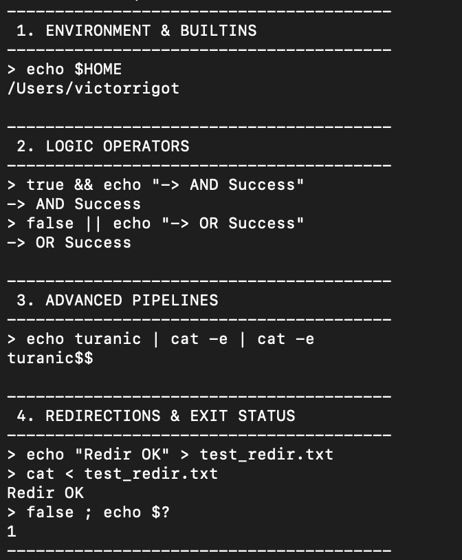
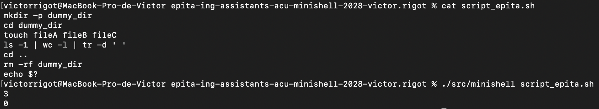
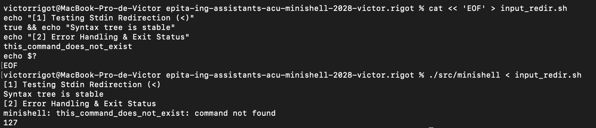

# Minishell: POSIX-Compliant UNIX Shell Architecture

> **⚠️ Academic Integrity Disclaimer:** The full source code for this project is kept strictly private to comply with the academic integrity and anti-plagiarism policies of EPITA. This repository serves as a technical showcase and architectural overview of the project.

## 🚀 Overview
Developed a fully functional, POSIX-compliant command-line interpreter from scratch in **C**. This project replicates the core behavior of standard UNIX shells (like `bash` or `sh`), handling complex command lines, pipes, redirections, and process execution.

## 🧠 System Architecture
To ensure scalability and maintainability, the shell was designed using a modular compiler-like pipeline:

1. **Lexer (Tokenizer):** Reads the raw user input string and converts it into meaningful tokens (words, operators, quotes).
2. **Parser:** Validates the grammatical syntax of the tokens and constructs an **Abstract Syntax Tree (AST)**.
3. **AST Executor:** Traverses the tree node by node to execute the commands using low-level UNIX system calls (`fork`, `execve`, `pipe`, `dup2`, `waitpid`, `chdir`).

## ⚙️ Key Technical Achievements
* **Advanced Process Synchronization:** Handled complex pipelines (`|`) and file redirections (`>`, `<`, `>>`) without deadlocks or file descriptor leaks.
* **Robust Memory Management:** Achieved 100% leak-free execution. All dynamically allocated memory (for AST nodes, environment variables, and buffers) is strictly managed and was extensively validated using **AddressSanitizer (ASan)**.
* **Quality Assurance:** Designed a comprehensive test suite covering standard POSIX compliance and obscure edge-cases (e.g., empty pipes, trailing spaces, complex quoting).

## 📸 Demonstration

The shell is rigorously tested and fully supports the three POSIX input methods required by the standard:

### 1. Standard Input via Pipe (`|`)
Handling complex logical sequences (`&&`, `||`), process pipelines, and special exit status variables (`$?`).

### 2. File Execution Mode
Executing a script file passed as an argument, validating the `cd` builtin and working directory manipulation.

### 3. Standard Input Redirection (`<`)
Reading from redirected `stdin`, demonstrating robust AST error handling and proper return codes (e.g., `127` for command not found).

---
*Developed by Victor Rigot.*
